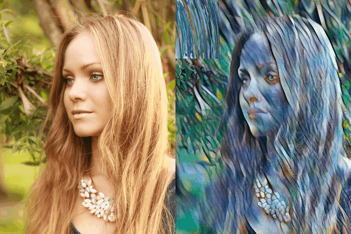

# Adaptive Instance Normalization

Unofficial Pytorch implementation of [Arbitrary Style Transfer in Real-time with Adaptive Instance Normalization](http://openaccess.thecvf.com/content_ICCV_2017/papers/Huang_Arbitrary_Style_Transfer_ICCV_2017_paper.pdf)

## Requirements

### Dependecies

- Python 3.6
- Pytorch 1.0+
- Torchvision
- Pillow
- skimage

### Dataset

- [MS-COCO Train Images (2014)](http://cocodataset.org/#download) - 13GB - put `train2014` directory in `data/` directory and rename it as `content`
- [Painter by Numbers, wikiart](https://www.kaggle.com/c/painter-by-numbers) - 36GB - put `train` directory in `data/` directory and rename it as `style`

## Usage

```
├── data
    └── content
        ├── COCO_train2014_xxx.jpg
        └── ...
    └── style
        ├── xxx.jpg
        └── ...
├── img
    ├── content
    ├── style
├── models
	└── AdaIN.model
├── results
	└── xxx.jpg
```

### Train

```
python main.py train --content_dir ./data/content --style_dir./data/style --epochs 20
```

### Test

```
python main.py train --model_dir ./models/AdaIN.model -c ./img/content/blonde_girl.jpg -s ./img/style/antimonocromatismo.jpg
```

## Results

