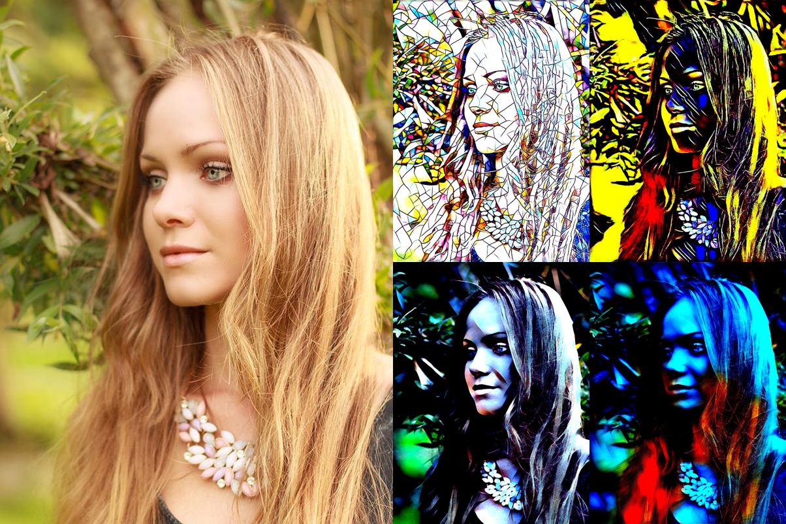
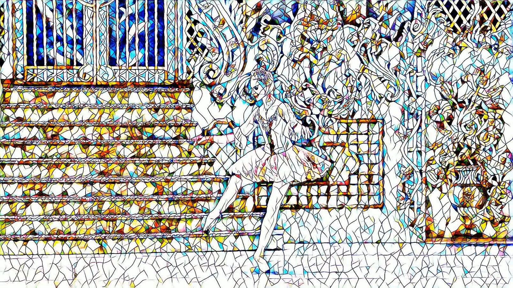

# Fast Neural Style Transfer

Unofficial Pytorch implementation of [Perceptual Losses for Real-Time Style Transfer and Super-Resolution](https://arxiv.org/abs/1603.08155).

## Requirements

### Dependecies

- Python 3.6
- Pytorch 1.0+
- Torchvision
- Pillow
- skimage
- Opencv

### Dataset

- [MS-COCO Train Images (2014)](http://cocodataset.org/#download) - 13GB - put `train2014` directory in `dataset/` directory

## Usage

```
├── data
   └── train2014
       ├── COCO_train2014_xxx.jpg
       └── ...
├── content_img
   └── content images
├── style_img
   └── style images
├── models
   ├── cubist.model
   ├── mosaic.model
   ├── picasso.model
   └── udnie.model
├── results
   ├── berk_lib
   ├── blonde_girl
   └── Niagara
├── video
   └── ballet.mp4
```

### Train

```
python main.py train --style_img ./style_img/mosaic.jpg
```

### Stylize Image

```
python main.py style --content_path ./content_img/Niagara.jpg --model ./models/mosaic.model
```

### Style Video

```
python main.py video --video_path ./video/ballet.mp4 --model ./models/mosaic.model
```

## Results




## Video

<p align = 'center'>
<a href="https://youtu.be/RLdqBJUiXw0">

</a>
</p>