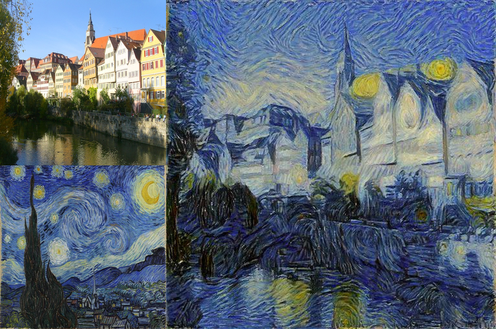

# Image-Based Neural Style Transfer

Unofficial Pytorch implementation of [A Neural Algorithm of Artistic Style](https://arxiv.org/abs/1508.06576).

## Requirements

- Python 3.6
- Pytorch 1.0+
- Torchvision
- Pillow
- skimage

## Usage

```
├── data
   ├── content images
   └── style images
├── models
   └── VGG-19
├── results
   └── output images
```

### Train

```
python main.py --content content_starry --style style_vangogh --alpha 1 --beta 1e4 --iter 400 --lr 1 --down True
```

```
usage: main.py [--content CONTENT NAME] 
               [--style STYLE NAME]
               [--lr LEARNING RATE] 
               [--iter ITERATION] 
               [--alpha ALPHA] 
               [--beta BETA] 
               [--down DOWNLOAD VGG-19 TO ./models]
```

## Results




