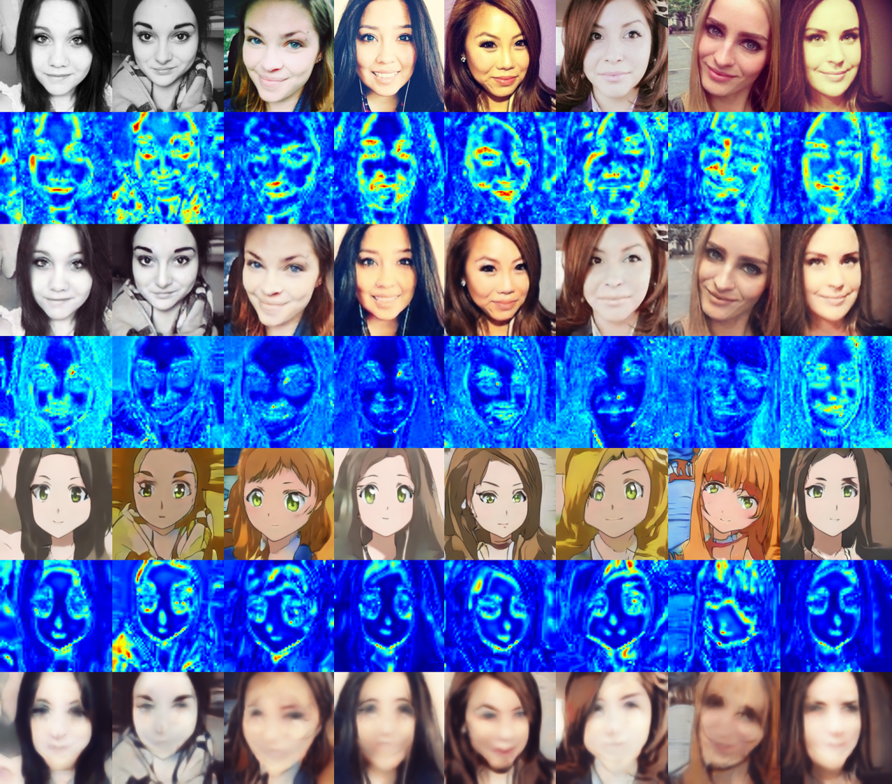

# U-GAT-IT

Unofficial Pytorch implementation of [U-GAT-IT: Unsupervised Generative Attentional Networks with Adaptive Layer-Instance Normalization for Image-to-Image Translation](https://arxiv.org/abs/1907.10830)

## Requirements

### Dependecies

- Python 3.6
- Pytorch 1.0+
- Torchvision
- Pillow

### Dataset

- [selfie2anime dataset](https://drive.google.com/file/d/1xOWj1UVgp6NKMT3HbPhBbtq2A4EDkghF/view?usp=sharing)  - put `selfie2anime` directory in `dataset/` directory

### Pre-trained model

- [selfie2anime_params_0100000.pt](https://drive.google.com/file/d/1g2fUPuGRutkBM6buuKON_eFEZNmWK-Zn/view?usp=sharing) - put `selfie2anime_params_0100000.pt` in `results/selfie2anime/model` directory	

## Usage

```
├── dataset
   └── selfie2anime
       ├── trainA
           ├── xxx.jpg (name, format doesn't matter)
           ├── yyy.png
           └── ...
       ├── trainB
           ├── zzz.jpg
           ├── www.png
           └── ...
       ├── testA
           ├── aaa.jpg 
           ├── bbb.png
           └── ...
       └── testB
           ├── ccc.jpg 
           ├── ddd.png
           └── ...
├── results
   └── selfie2anime
       ├── img
       ├── model
           ├── selfie2anime_params_0100000.pt
           └── ...
       └── test
```

### Train

```
python main.py --phase train --dataset selfie2anime --iteration 100000 --light True
```

Set --light as True if CUDA is out of memory.

### Test

First you need to put `selfie2anime_params_0100000.pt` in `results/selfie2anime/model` directory	

```
python main.py --phase test --dataset selfie2anime
```

You can find the test results at `results/selfie2anime/test`.

## Results

